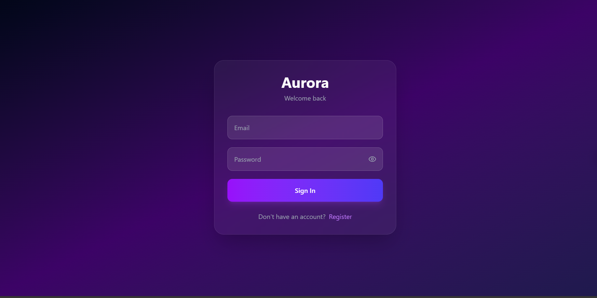
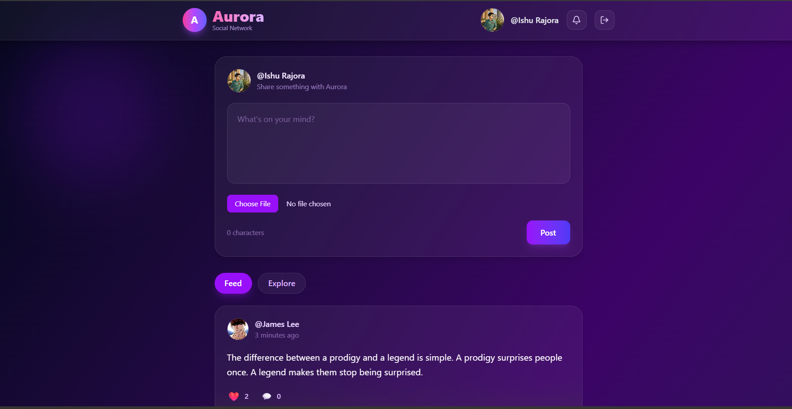
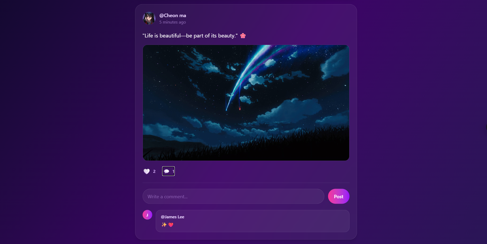
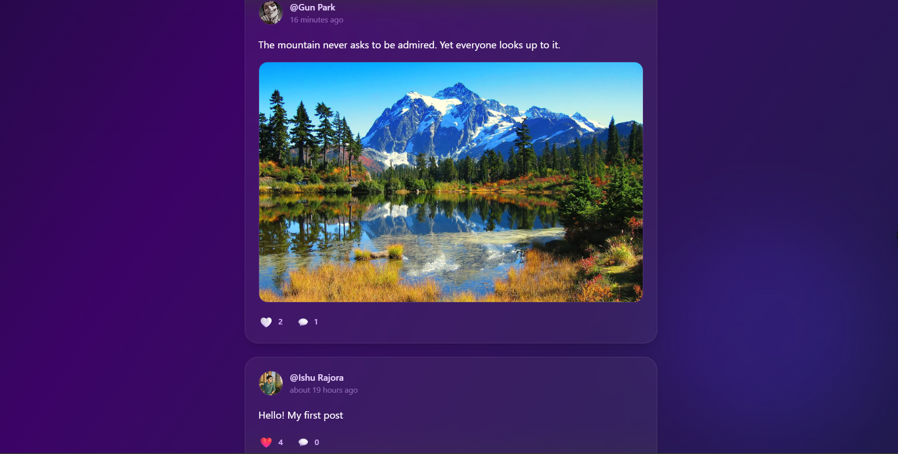
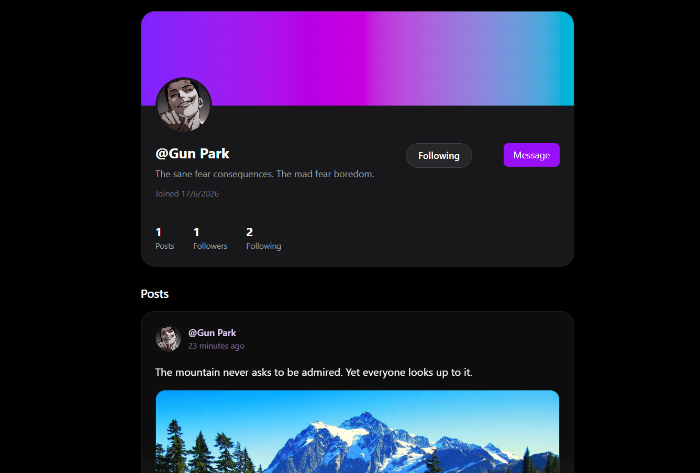
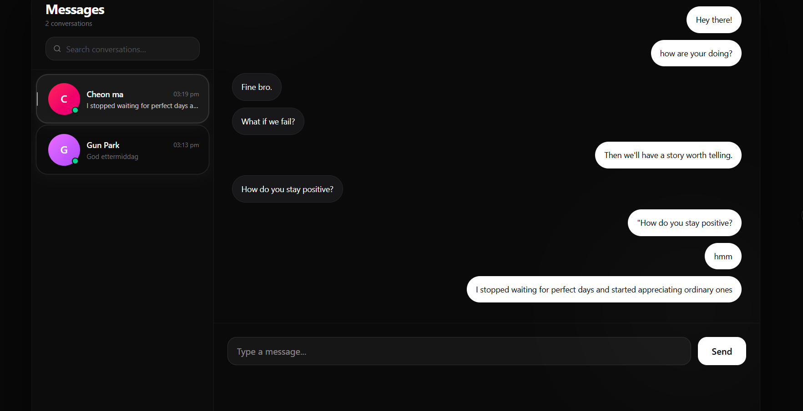

# Aurora

A production-oriented full-stack social media platform built to demonstrate modern backend engineering, real-time communication, caching, containerization, and deployment practices.

Aurora focuses on production readiness, scalability, maintainability, performance optimization, infrastructure, and clean architecture rather than simply adding social media features.

---

## Live Demo

**Frontend:** https://aurora-seven-orpin.vercel.app/

**Backend API:** https://aurora-evlj.onrender.com

---

## Tech Stack

### Backend

* Java 17
* Spring Boot
* Spring Security
* JWT Authentication
* Spring Data JPA
* PostgreSQL
* Redis
* Spring WebSocket (STOMP)
* Maven
* Lombok
* Bean Validation

### Frontend

* React
* Vite
* Tailwind CSS v4
* Axios
* React Router DOM
* Framer Motion
* React Hot Toast
* Lucide React

### Infrastructure

* Docker
* Docker Compose
* PostgreSQL
* Redis
* Cloudinary

---

## Architecture

```text
                    ┌─────────────────┐
                    │  React Frontend │
                    └────────┬────────┘
                             │
                             ▼
                    ┌─────────────────┐
                    │ Spring Boot API │
                    └────────┬────────┘
                             │
        ┌────────────────────┼────────────────────┐
        │                    │                    │
        ▼                    ▼                    ▼
 ┌──────────────┐   ┌──────────────┐   ┌────────────────┐
 │ PostgreSQL   │   │ Redis        │   │ Cloudinary     │
 │ Database     │   │ Cache/PubSub │   │ Media Storage  │
 └──────────────┘   └──────────────┘   └────────────────┘
                             │
                             ▼
                     WebSocket STOMP
                             │
                             ▼
                    Real-Time Delivery
```

---

## Features

### Authentication

* User Registration
* User Login
* JWT Authentication
* BCrypt Password Hashing
* Protected Routes
* Stateless Security

### Profiles

* User Profiles
* Profile Editing
* Bio Updates
* Profile Picture Upload

### Posts

* Create Posts
* Delete Posts
* Text Posts
* Image Posts
* Personalized Feed
* Explore Feed
* Infinite Scrolling

### Follow System

* Follow Users
* Followers Count
* Following Count

### Likes

* Toggle Like Functionality

### Comments

* Create Comments
* View Comments

### Notifications

* Follow Notifications
* Like Notifications
* Comment Notifications
* Real-Time Notifications
* Unread Count Tracking
* Read All Functionality

### Messaging

* Real-Time Chat
* Private Conversations
* Conversation History
* Unread Counts
* Optimistic UI Updates

### Media Management

* Cloudinary Integration
* Post Image Uploads
* Profile Picture Uploads

---
## Highlights

- JWT Authentication & Authorization
- Redis Explore Feed Caching
- Redis Pub/Sub Messaging
- Real-Time Notifications
- Real-Time Chat
- Dockerized Infrastructure
- Cloudinary Media Storage
- Infinite Scrolling Feed
- DTO-Based API Design
- WebSocket Authentication
---

## Redis Implementation

### Explore Feed Caching

Aurora uses a manual RedisTemplate implementation instead of Spring's `@Cacheable` abstraction to better understand caching internals.

Cache flow:

```text
Explore Request
        ↓
Redis Lookup
        ↓
Cache Hit
        ↓
Return Cached Response
```

or

```text
Explore Request
        ↓
Cache Miss
        ↓
Database Query
        ↓
Store In Redis
        ↓
Return Response
```

#### Cache Key Format

```text
explore:page:{page}:size:{size}
```

#### Cache TTL

```text
60 Seconds
```

#### Cache Invalidation

* Post Creation
* Post Deletion

---

### Redis Pub/Sub

Aurora uses Redis Pub/Sub for chat delivery.

```text
Message Created
        ↓
Redis Publish
        ↓
Redis Subscriber
        ↓
WebSocket Delivery
        ↓
Receiver Gets Message
```

Benefits:

* Decoupled Architecture
* Event-Driven Communication
* Multi-Instance Scalability
* Distributed System Foundation

---

## Real-Time Communication

Aurora uses JWT-authenticated STOMP WebSockets.

Implemented features:

* Real-Time Notifications
* Real-Time Messaging
* User Destination Queues
* Secure WebSocket Authentication

```text
Client Connects
        ↓
JWT Validation
        ↓
WebSocket Session Created
        ↓
User Subscribed To Queue
        ↓
Real-Time Event Delivered
```

---

## Pagination & Infinite Scrolling

### Backend

* Spring Data Page
* Pageable

### Frontend

* IntersectionObserver
* Loading States
* Request Locking
* Infinite Scroll

The frontend consumes paginated responses through:

```javascript
response.data.content
```

---

## Security

### JWT Authentication

Authentication is fully stateless.

```text
Login
 ↓
JWT Generated
 ↓
Stored On Client
 ↓
Authorization Header
 ↓
Request Authentication
```

### Identity Separation

Authentication uses email:

```java
@Override
public String getUsername() {
    return email;
}
```

Public identity uses username:

```java
public String getDisplayUsername() {
    return username;
}
```

### DTO Architecture

Entities are never exposed directly.

Examples:

* UserProfileResponse
* PostResponseDTO
* CommentResponseDTO
* NotificationResponseDTO
* MessageResponseDTO

Benefits:

* Security
* API Stability
* Reduced Coupling
* Better Maintainability

---

## Docker Infrastructure

Aurora is fully containerized.

Containers:

* aurora-backend
* aurora-postgres
* aurora-redis

Backend communicates through Docker service discovery.

PostgreSQL:

```text
jdbc:postgresql://postgres:5432/socialmedia
```

Redis:

```text
redis
```

Benefits:

* Consistent Environments
* Easier Deployment
* Simplified Dependency Management
* Improved Portability

---

## Environment Variables

```env
JWT_SECRET=

CLOUDINARY_CLOUD_NAME=
CLOUDINARY_API_KEY=
CLOUDINARY_API_SECRET=
```

Never commit secrets to source control.

---

## Local Development

### Clone Repository

```bash
git clone YOUR_REPOSITORY_URL
cd Aurora
```

### Start Infrastructure

```bash
docker compose up -d
```

### Start Backend

```bash
./mvnw spring-boot:run
```

### Start Frontend

```bash
npm install
npm run dev
```

---

## Screenshots

### Login Page



### Feed - Home Timeline



### Feed - Explore



### Feed - Infinite Scrolling



### Profile



### Messaging



---

## Engineering Challenges Solved

* JWT Authentication Architecture
* WebSocket Authentication
* Redis Cache Invalidation
* Redis Pub/Sub Integration
* Docker Networking
* Environment-Based Configuration
* DTO-Based API Design
* Infinite Scrolling
* Cloudinary Integration
* Real-Time Notifications
* Real-Time Chat

---

## Future Improvements

* Redis Rate Limiting
* Image Optimization
* N+1 Query Investigation
* Automated Testing
* Monitoring & Observability
* CI/CD Pipeline
* Docker Hardening
* Performance Optimization

---

## Design Goals

Aurora was designed to demonstrate:

- Production-ready backend architecture
- Secure authentication and authorization
- Real-time communication systems
- Distributed caching strategies
- Containerized deployment workflows
- Scalable API design
- Infrastructure-aware development

---

## Author

**Ishu Kumar Rajora**

B.Tech Student | Java Backend Developer | Full Stack Developer

Focused on Backend Engineering, System Design, Distributed Systems, and Production-Ready Software Development.
